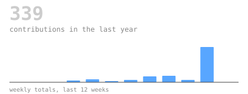
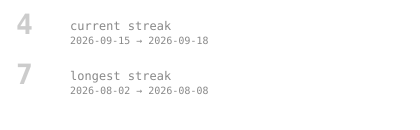
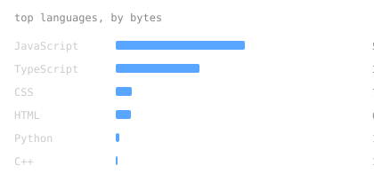
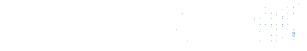

<picture></picture>

<blockquote>
B.Tech CS @ Lovely Professional University · building toward SDE-1 · MERN, Redis, LLM APIs
</blockquote>

 

<samp>MERN &nbsp;·&nbsp; Redis &nbsp;·&nbsp; Gemini / Groq APIs &nbsp;·&nbsp; DSA</samp>

  

<picture></picture>

<picture></picture>

<picture></picture>

<picture></picture>

 

<samp>github.com/Jyatin</samp>
